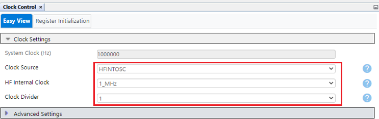
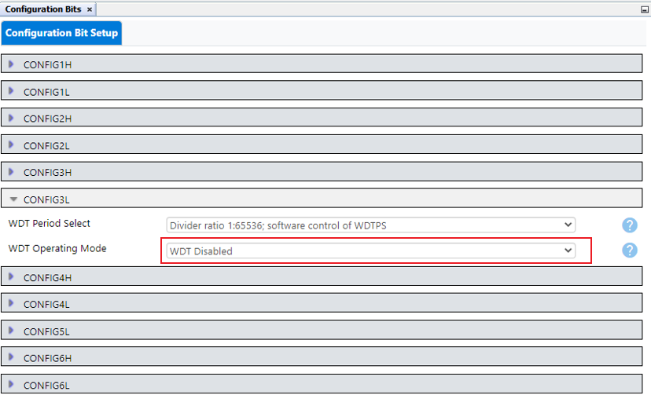
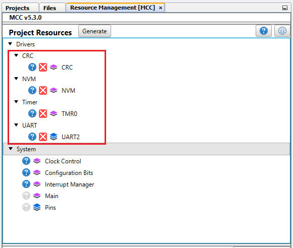
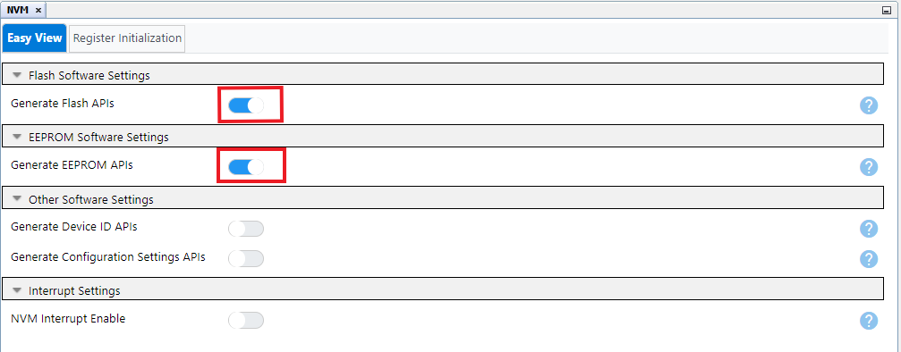
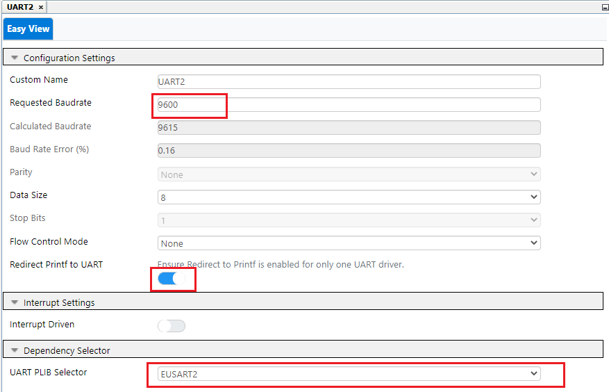
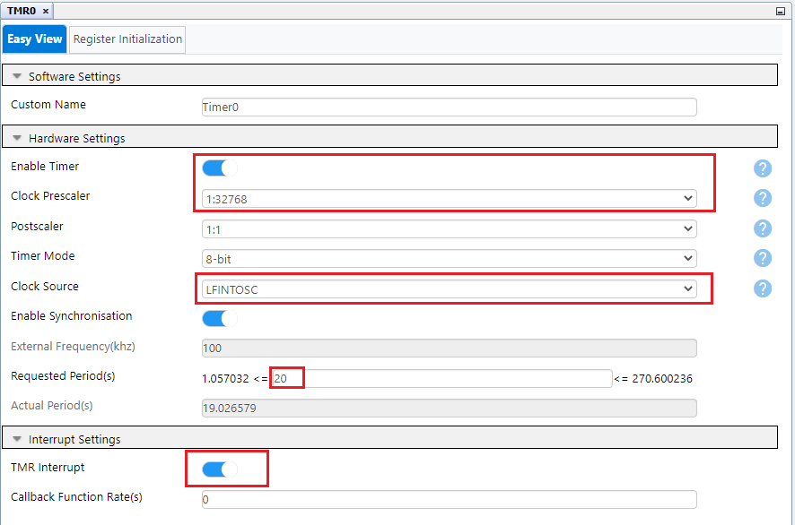
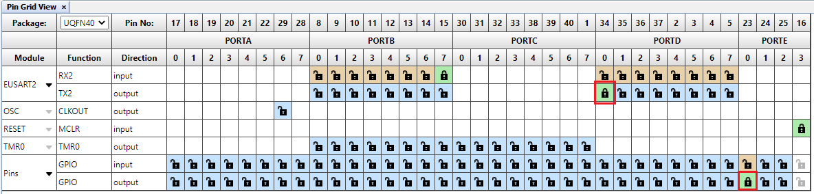
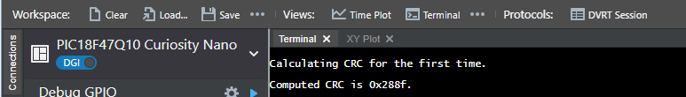
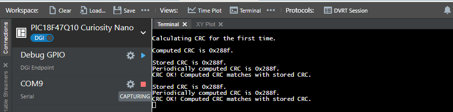

# CRC with MEMORY SCANNER

# Introduction

This example demonstrates the use of CRC peripheral in PIC18F47Q10 microcontroller. CRC module in PIC microcontrollers is hardware implemented checksum generator which computes 16-bit CRC with programmable polynomial. It is coupled with memory scanner for faster CRC calculations. The memory scanner can automatically provide data to the CRC module This example uses CRC-16-CCITT standard parameters.
This demo calculates the CRC of the program memory and store it in the EEPROM area of the controller after programming the device for the first time. On the subsequent power-ups, the device computes the flash CRC at startup and checks it against the CRC stored in EEPROM area. In case of mismatch the program execution is indicates CRC error. This CRC checking can be scheduled periodically during device operation to ensure flash integrity.

Figure 1: Program Flowchart

# Useful Links
- [PIC18-Q10 Product Family Page](https://www.microchip.com/design-centers/8-bit/pic-mcus/device-selection/pic18f-q10-product-family)
- [PIC18F47Q10 Data Sheet](https://www.microchip.com/DS40002043)
- [PIC18F47Q10 Code Examples on GitHub](https://github.com/microchip-pic-avr-examples?q=pic18f47q10)

# Hardware Used
* [PIC18F47Q10 Curiosity Nano](https://www.microchip.com/Developmenttools/ProductDetails/DM182029)

With full program and debug capabilities, the PIC18F47Q10 Curiosity Nano evaluation kit offers complete support for the new design. With the award-winning MPLAB X integrated development platform and MPLAB Code Configurator (MCC), the kit provides access to the Intelligent analog and Core Independent Peripherals on the PIC18F47Q10.

Figure 2: PIC18F47Q10 Curiosity Nano board
# Software tools
Microchip’s free MPLAB X IDE, compiler and MPLAB Code Configurator (MCC) graphical code generator are used throughout the application firmware development to provide easy and hassle-free user experience. Following are the tool versions used for this demo application:

* [MPLAB® X IDE v5.45](https://www.microchip.com/mplab/mplab-x-ide)
* [XC8 Compiler v2.31](https://www.microchip.com/mplab/compilers)
* [MPLAB® Code Configurator (MCC) v4.1.0](https://www.microchip.com/mplab/mplab-code-configurator)
* [MPLAB®  Code Configurator Library (CCL) v1.37.14](https://www.microchip.com/mplab/mplab-code-configurator)
* [MCC Device Libraries PIC10 / PIC12 / PIC16 / PIC18  MCUs v1.81.7](https://www.microchip.com/mplab/mplab-code-configurator)
* [Microchip PIC18F-Q Series Device Support 1.9.175](https://packs.download.microchip.com/)

*Note: For running the demo, the installed tool versions should be same or later. This example is not tested with previous versions.*

# Demo realization
1. **Start by creating a new Project and open MCC**

	* Go to File > New Project
	* Select Microchip Embedded > Standalone Project
	* Enter the device name. In this case we are using the PIC18F47Q10
	* Name the project
	* Open the MCC by clicking on MCC logo

2. **Configure the hardware peripherals**

*  **Configure Clock**

Open "Clock Control" setup present under "System" dropdown menu in "Project Resources" tab.
* Set "Clock Source" as "HFINTOSC"
* Set "HF Internal Clock" as "1_MHz"
* Set "Clock Divider" as "1"

Figure 3: Clock Control

*	**Configure Configuration Bits**

Open "Configuration Bits" setup present under "System" dropdown menu in "Project Resources" tab.

* Set "WDT Operating Mode" bit of CONFIG3L register to "WDT Disabled" to disable the watchdog timer.

Figure 4: Configuration Bits

*  **Add peripherals to the project**

Add CRC, EUSART2, TMR0 and MEMORY peripherals to the project.

Make sure to add peripherals present under "Drivers" dropdown menu in "Device Resources" tab.

Figure 5: Peripherals

* **Configure the CRC peripheral**

* Verify that CRC is enabled
* Verify that “Use Pre-defined Polynomial” is enabled
* Select “CRC-16-CCITT” from list of "Pre-defined Polynomial"
* Set the “Seed” value to “0xFFFF”
* Set "Augmentation Mode" to "data not augmented with 0's"
* Set “Data Word Width (bits)” to “16” (As Flash memory data width is 16-bits)
* Verify that Scanner is enabled (We will use scanner to fetch data from memory)

Figure 6: CRC Configuration

* **Configure Memory peripheral**

Verify that “Add DataEE Routines” is set (We will use these routines to write EEPROM data)

Figure 7: Memory Configuration

* **Configure EUSART2 Peripheral**

In this demo, EUSART2 is used to transmit data on the terminal window to display the stored and computed CRC value as well as the error message if there is any mismatch in the CRC is detected.

* Enable "Redirect STDIO to EUSART"
* Set the Baud Rate to 9600
* Disable Receive
* Verify that Transmit is enabled
* Verify that Serial Port is enabled

Figure 8: EUSART2 Configuration

* **Configure TMR0 Peripheral**

In this demo Timer 0 is used to generate periodic event for checking the CRC of the program memory.
Timer 0 period can be changed to change the CRC calculation frequency.

* Verify that Timer is enabled
* Select the clock pre-scaler as 1:32768
* Select the clock source as LFINTOSC
* Set the desired timer period. The period selected in this example is 20 s
* Enable Timer Interrupt

Figure 9: Timer 0 Configuration

* **Configure the pins used on the device**

* Set RE0 as output pin using pin Manager: Grid View. LED is connected to pin RE0.
* Select RD0 as EUSART2: TX2 output.
* RB7 used for RX2 and RA4 used for T0CKI can be deselected.

Figure 10: Pin Manager: Grid View

Add custom name to the RE0 output pin as LED, using Project Resources → System → Pin Manager. Check the "Start High" check box for LED pin RE0 for turning off the LED.

Figure 11: Pin Manager

3. **Generate the Project files**
* Click the Generate button next to the project Resources heading to generate Initializers and drivers for configured peripherals. Next step is to add custom code to complete the example as following.

**Open main.c file.**

Steps to calculate flash CRC using MCC generated APIs:

* Set memory SCAN address limits or block size of the program memory of which CRC to be calculated using following API:

`CRC_SetScannerAddressLimit(START_ADDRESS, END_ADDRESS);`

(Start address used in this demo is 0x00000 and end address used is 0x7FFE. So total block size of the memory used for CRC calculation is 32Kb.)

*Note: If the program size exceeds 32Kb then increase the block size by changing the End address*

* Start the memory Scanner using the following MCC generated API:

`CRC_StartScanner();`

* Check if memory Scan is completed:

`while(CRC_IsCrcBusy() || CRC_IsScannerBusy());`

* Calculate and read CRC using the following MCC generated API:

`CRC_GetCalculatedResult(false,0x00);`

4. **Build the project file and program the device**
* Connect PIC18F47Q10 Curiosity Nano to PC using USB cable. Program the microcontroller by clicking “Make and Program Device” icon on MPLAB X IDE as shown in below figure.

Figure 12: Program the device

# Demo operation
* For the first power up or whenever firmware is changed w.r.t earlier firmware , uncomment the line `//#define ERASE_EEPROM_CRC` in the code, to erase the EEPROM location, which stores the CRC. This makes sure that there isn’t any incorrect or earlier calculated CRC value stored previously at that location. Build the project and program the device. Observe the message displayed on the terminal window.

*(Any terminal emulator such as [MPLAB Data Visualizer](https://www.microchip.com/en-us/development-tools-tools-and-software/embedded-software-center/mplab-data-visualizer) can be used. Set baud rate as 9600.)*

Figure 13: EEPROM erase message

* For the next power ups, comment the line `#define ERASE_EEPROM_CRC`. Build the project and program the device.
* Microcontroller calculates and displays the CRC of the program memory on the terminal window. The first calculated CRC is stored in the EEPROM location. The stored CRC then is compared with the calculated CRCs on subsequent power ups of the devices as well as with the periodic calculated CRC. If there is mismatch in CRC, then program execution can be halted, and corresponding action can be taken.

Figure 14: First Time CRC calculation

* CRC of the program is calculated periodically and displayed on the terminal window.
* If there is mismatch in the stored CRC and computed CRC, then error message is displayed, and program execution is halted.

Figure 15: Periodic CRC

*Note: CRC in Figure14 is computed using compiler v2.31 with -0 optimization level.*

# Conclusion
CRC module in PIC microcontrollers is hardware implemented checksum generator which can compute 16-bit CRC with programmable polynomial. It is also complimented with memory scanner feature which provides automatic flash read for CRC calculation. Configuring the CRC module is easy using the MCC GUI. Apart from the module configuration, MCC generates ready to use APIs, for hassle free calculation of the CRC of the program memory, using CRC and memory scan hardware peripheral in the PIC microcontrollers.
